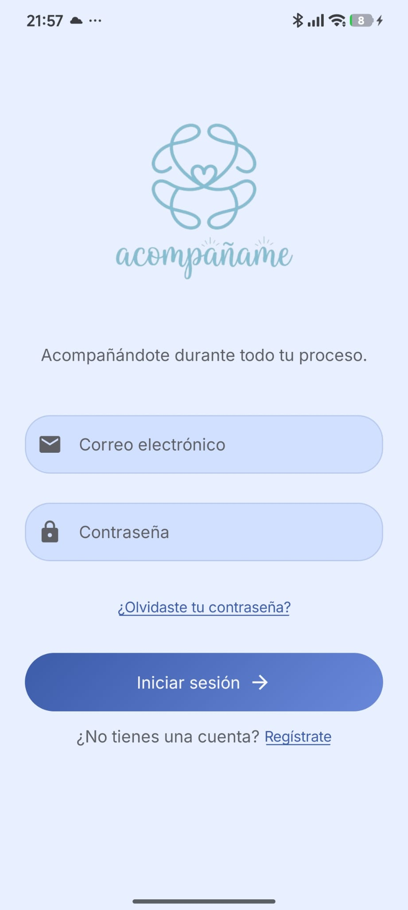
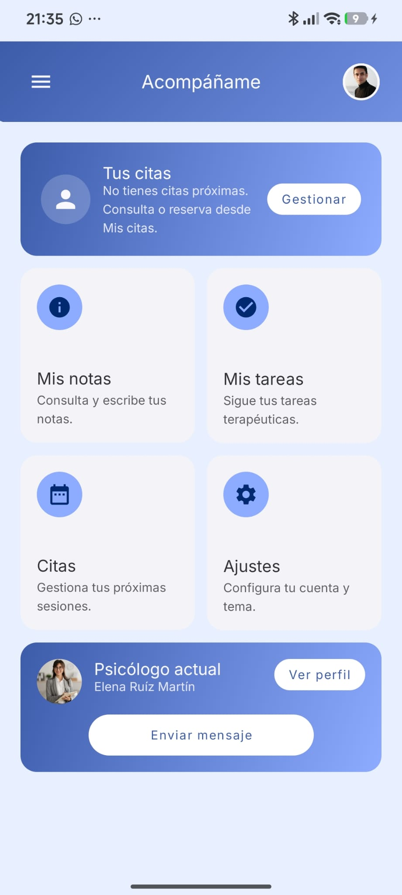
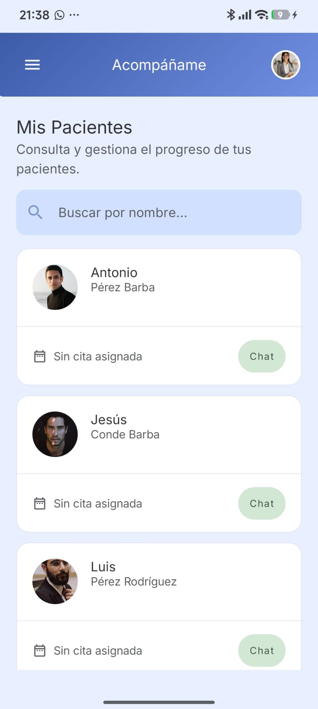
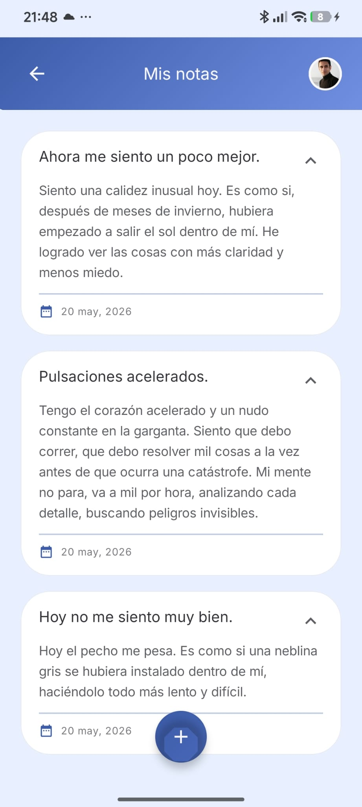
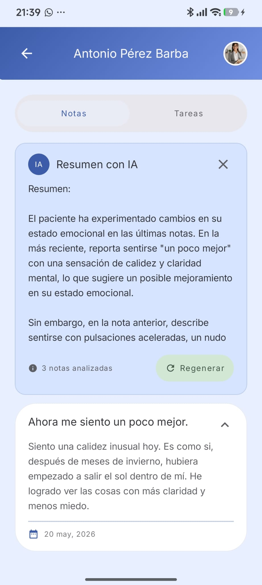
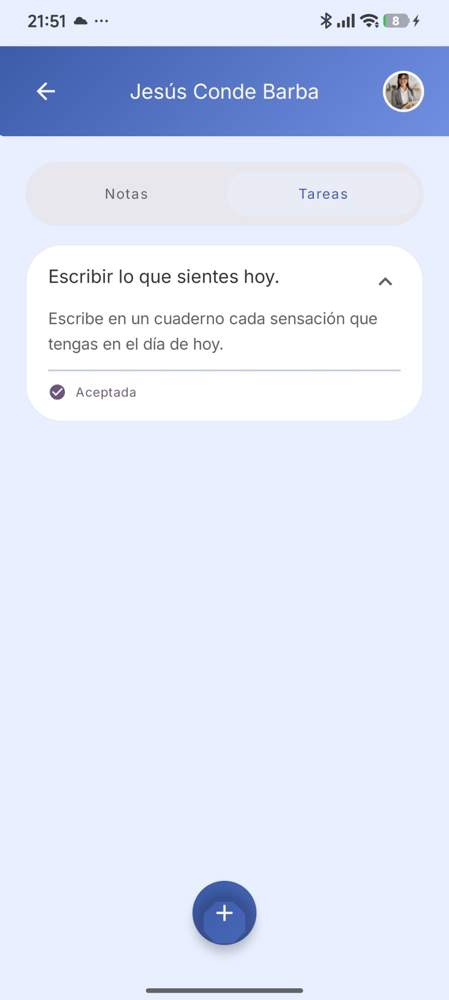
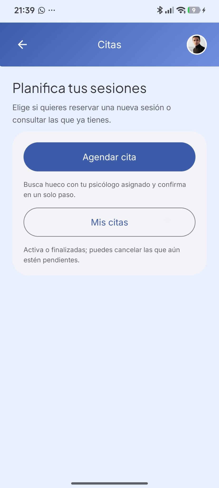
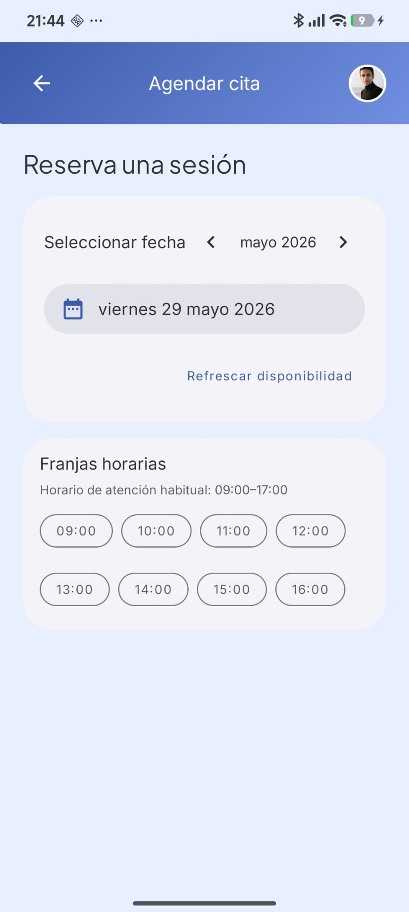
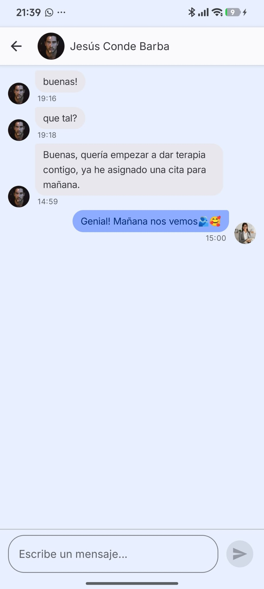

# acompañame — Cliente Android (PsicologíaApp)

Aplicación móvil del **Trabajo de Fin de Grado (DAM2)** que conecta **pacientes** y **psicólogos** en un entorno digital seguro: gestión de notas, tareas terapéuticas, citas, chat en tiempo real y notificaciones push. Forma parte del ecosistema **PsicologíaApp** junto con la API REST **bdPsicologiaApp** (repositorio hermano del backend).

<p align="center">
  
  
  
</p>

---

## Descripción

**acompañame** (`dam2.tfg.psicologiaapp`) es el cliente nativo para Android. Los usuarios se autentican con **Firebase Auth**; el resto de la lógica de negocio (perfiles, notas, tareas, citas, IA de resumen, etc.) se sincroniza con el backend Spring Boot mediante **Retrofit**, enviando el token de identidad en cada petición.

El chat y las alertas de riesgo en notas usan **Firebase Realtime Database** y **Firebase Cloud Messaging (FCM)** para tiempo real y push, coordinados con el servidor.

---

## Funcionalidades principales

| Área | Paciente | Psicólogo |
|------|----------|-----------|
| **Cuenta** | Registro, inicio de sesión, recuperación de contraseña, foto de perfil | Igual + alta con número de colegiado y especialidades |
| **Vínculo** | Elegir y asignar psicólogo | Listado y ficha de pacientes asignados |
| **Notas** | Crear, editar y consultar notas personales | Ver notas del paciente; resumen asistido por IA (vía API) |
| **Tareas** | Ver tareas asignadas, marcar realizadas / aceptadas | Crear y gestionar tareas por paciente |
| **Citas** | Consultar disponibilidad, reservar y ver mis citas | Agenda de citas con pacientes |
| **Chat** | Mensajería con el psicólogo asignado | Chat por paciente |
| **Notificaciones** | Mensajes, nuevas tareas | Alertas clínicas de riesgo (IA en backend) |
| **Preferencias** | Tema claro / oscuro / sistema, ajustes de cuenta | Hub de ajustes y perfil profesional |

---

## Stack tecnológico

| Categoría | Tecnología |
|-----------|------------|
| Lenguaje | Kotlin |
| UI | Jetpack Compose, Material 3 |
| Arquitectura | MVVM por capas + casos de uso |
| DI | Hilt (Dagger) |
| Navegación | Navigation Compose (grafos anidados paciente / psicólogo) |
| Red | Retrofit, OkHttp, Gson |
| Persistencia local | Room, DataStore (preferencias) |
| Identidad y tiempo real | Firebase Auth, Realtime Database, FCM, App Check (release) |
| Imágenes | Coil |
| Async | Kotlin Coroutines, `StateFlow` |
| Build | Gradle Kotlin DSL, product flavors `local` / `prod` |

**Requisitos:** Android SDK 26+, `compileSdk` 36, JDK 11.

---

## Arquitectura del código

El paquete raíz `dam2.tfg.psicologiaapp` organiza el proyecto por **features** y capas:

```
dam2.tfg.psicologiaapp/
├── auth/              # Inicio de sesión, registro, tokens Firebase
├── usuario/           # Perfil, sincronización, caché Room
├── paciente/          # Alta paciente, asignación de psicólogo
├── psicologo/         # Perfil profesional, pacientes, especialidades
├── nota/              # CRUD notas + sync incremental
├── tarea/             # Tareas terapéuticas
├── cita/              # Disponibilidad y reservas
├── chat/              # RTDB + notificaciones de mensajes
├── notificaciones/    # FCM, alertas de riesgo, canales Android
├── resumenIa/         # Consumo del endpoint de resumen IA
├── preferencias/      # Tema y DataStore
├── data/              # Cliente HTTP compartido, DTOs de sync
├── di/                # Módulos Hilt (red, BD, repositorios)
├── presentation/      # Compose, ViewModels, navegación
├── ui/theme/          # Tema visual (tipografía, colores, formas)
├── MainActivity.kt
└── PsicologiaApp.kt   # Application + App Check en release
```

**Flujo de dependencias:** `presentation` → `domain` ← `data`. El dominio no depende de Android ni de Retrofit.

Documentación ampliada del sistema completo: [`doc/DISEÑO_SISTEMA.md`](doc/DISEÑO_SISTEMA.md).

---

## Instalación

Puedes usar la app de dos maneras: **descargar el APK publicado en GitHub** (más rápido) o **compilar el proyecto** en tu máquina (desarrollo o personalización).

### Descargar desde GitHub Releases

En cada **Release** de este repositorio en GitHub (`Releases` → versión etiquetada, p. ej. `v1.0`) se publica el APK listo para instalar, compilado con el flavor **`prod`** (API de producción en Render).

1. Abre la pestaña **Releases** del repositorio (o el enlace *Latest release* en la barra lateral de GitHub).
2. Descarga el fichero **`acompaname-prod-release.apk`** (o el nombre indicado en las notas de esa versión).
3. Transfiérelo al teléfono e instálalo. Si Android lo pide, permite la instalación desde **orígenes desconocidos** para ese navegador o gestor de ficheros.
4. Abre la app e inicia sesión o regístrate. Necesitas conexión a Internet y que el backend público esté operativo.

> **Importante:** el APK de GitHub **no incluye** `google-services.json` (está en `.gitignore`). Las releases oficiales del TFG se generan con la configuración Firebase del autor embebida en el build. Si compilas tú el APK, debes añadir tu propio `google-services.json` en `app/` (ver más abajo).

| Release | Contenido habitual |
|---------|-------------------|
| **Latest** | APK `prod` + notas de versión (novedades y correcciones) |
| **Assets** | APK firmado; opcionalmente changelog en el cuerpo de la release |

**Requisitos en el dispositivo:** Android 8.0 (API 26) o superior.

#### Generar el APK para una nueva release (mantenedores)

Desde la raíz del repositorio, con `google-services.json` en `app/`:

```bash
./gradlew :app:assembleProdRelease
```

El APK queda en:

`app/build/outputs/apk/prod/release/app-prod-release.apk`

Renómbralo si quieres (por ejemplo `acompaname-prod-release.apk`), súbelo como asset en GitHub (*Releases → Draft a new release → Attach binaries*) y etiqueta la versión según `versionName` en `app/build.gradle.kts` (p. ej. `v1.0`).

---

## Configuración y ejecución (desde código fuente)

### 1. Clonar e instalar dependencias

```bash
git clone <url-del-repositorio-psicologiaapp>
cd psicologiaapp
```

Abre el proyecto en **Android Studio** (Ladybug o superior recomendado) y deja que Gradle sincronice.

### 2. Firebase

1. Crea un proyecto en [Firebase Console](https://console.firebase.google.com/).
2. Añade una app Android con el `applicationId`: `dam2.tfg.psicologiaapp`.
3. Descarga `google-services.json` y colócalo en:

   `app/google-services.json`

   > El fichero está en `.gitignore` por seguridad; no lo subas al repositorio público.

4. Habilita **Authentication** (email/contraseña), **Realtime Database** y **Cloud Messaging**.
5. Configura las reglas de RTDB según tu entorno (ver `database.rules.json` en la raíz si aplica).

### 3. Backend local

Para el flavor **`local`**, la app apunta a `http://10.0.2.2:8080/` (emulador → localhost del PC).

Arranca el backend con perfil `dev` (ver README del repositorio `bdPsicologiaApp`):

```bash
# En el repo del backend
./gradlew bootRun --args='--spring.profiles.active=dev'
```

En **dispositivo físico**, cambia `BASE_URL` en `app/build.gradle.kts` (flavor `local`) por la IP de tu máquina en la red local.

### 4. Ejecutar la app

- Variante recomendada en desarrollo: **`localDebug`**
- Producción (API en Render): **`prodRelease`** o **`prodDebug`**

```bash
./gradlew :app:installLocalDebug
```

O desde Android Studio: *Run* con el flavor **local**.

Para generar un APK de producción localmente (el mismo tipo que se sube a Releases):

```bash
./gradlew :app:assembleProdRelease
```

### 5. Tests unitarios

```bash
./gradlew :app:testDebugUnitTest
```

---

## Product flavors y entornos

| Flavor | `BASE_URL` | Uso |
|--------|------------|-----|
| `local` | `http://10.0.2.2:8080/` | Desarrollo con emulador + backend local |
| `prod` | `https://bdpsicologiaapp.onrender.com/` | Despliegue público del TFG |

Opcional: `FIREBASE_RTDB_URL` en `build.gradle.kts` si la URL de Realtime Database no viene en `google-services.json`.

---

## Integración con el backend

- Todas las rutas REST usan el prefijo configurado en Retrofit (`BuildConfig.BASE_URL`).
- El **interceptor de autenticación** adjunta `Authorization: Bearer <firebase_id_token>`.
- Sincronización incremental mediante endpoints `/estado` (notas, tareas, citas) según diseño del API.
- La **clave de Groq** y la detección de riesgo en notas viven **solo en el servidor**; el cliente nunca las incluye.

---

## Galería de pantallas

### Autenticación y selección de rol

<p align="center">
  
  
</p>

### Pantallas principales

<p align="center">
  
  
</p>

### Gestión de notas y tareas

<p align="center">
  
  
  
</p>

### Citas y chat

<p align="center">
  
  
  
</p>

---

## Capturas y diseño

| Recurso | Ubicación |
|---------|-----------|
| Pantallas de la app | `doc/pantallas-app/` |
| Mockups / diseño UI | `doc/diseño-interfaz-app/` |
| Diseño de arquitectura | `doc/DISEÑO_SISTEMA.md` |

---

## Estructura del repositorio (raíz)

```
psicologiaapp/
├── app/                    
├── doc/                    
├── gradle/
├── build.gradle.kts
└── settings.gradle.kts
```

---

## Autor y contexto académico

Proyecto desarrollado como **TFG** del ciclo **DAM2** (Desarrollo de Aplicaciones Multiplataforma).  
Módulo: `dam2.tfg.psicologiaapp` · Curso académico 2025–2026.

---

## Licencia

Proyecto académico. Consulta con el autor antes de reutilizar o redistribuir el código fuera del ámbito del TFG.
