# Actividad 4 — Documentación técnica (borrador)

Índice:

1. [Organización técnica del proyecto](#1-organización-técnica-del-proyecto)
   - [1.1. Estructura de carpetas y paquetes](#11-estructura-de-carpetas-y-paquetes)
   - [1.2. Configuración inicial del entorno](#12-configuración-inicial-del-entorno-dependencias-librerías-frameworks)
   - [1.3. Arquitectura por capas](#13-arquitectura-por-capas)
2. [Configuración de la base de datos](#2-configuración-de-la-base-de-datos)
   - [2.1. Sistemas usados](#21-sistemas-usados)
   - [2.2. Conexión y propiedades de Spring](#22-conexión-y-propiedades-de-spring)
   - [2.3. Migraciones SQL en backend](#23-migraciones-sql-en-backend)
   - [2.4. Migraciones Room en cliente](#24-migraciones-room-en-cliente)
   - [2.5. Datos iniciales](#25-datos-iniciales)
   - [2.6. Reglas de Firebase Realtime Database](#26-reglas-de-firebase-realtime-database-chats)
3. [Conexión con la base de datos](#3-conexión-con-la-base-de-datos)
4. [Capturas de pantalla](#4-capturas-de-pantalla)
5. [Conclusión](#5-conclusión)

---

## 1. Organización técnica del proyecto

### 1.1. Estructura de carpetas y paquetes

**Frontend (repositorio `psicologiaapp`)**

El código de la aplicación vive en `app/src/main/java/dam2/tfg/psicologiaapp/`. La organización sigue dominios por *feature*: `auth`, `usuario`, `paciente`, `psicologo`, `nota`, `tarea`, `cita`, `chat` y `preferencias`. Además existe el paquete `core` con utilidades transversales. En cada dominio que toca datos y reglas aparece el patrón `data/{local, remote, mappers, repository}` y `domain/{model, repository, usecase}`. La capa de interfaz se agrupa en `presentation/`: pantallas y ViewModels bajo `presentation/ui/...`, componentes reutilizables en `presentation/components` y grafo de navegación en `presentation/navegacion`. Hay infraestructura compartida: `di/` (módulos Hilt), `data/local` y `data/remote` (por ejemplo base Room y cliente HTTP), `data/fuente` para abstracciones de origen de datos cuando aplica, y `ui/theme/` (tema Compose). Conviven algunos ficheros puente en `domain/modelo/` y similares con el mismo espíritu de capas.

El punto de entrada de proceso Android es la `Application` con `@HiltAndroidApp` en `PsicologiaApp.kt` y la actividad principal en `MainActivity.kt`:

```8:10:c:\Users\jesus\Documents\DAM2\TFG\psicologiaapp\app\src\main\java\dam2\tfg\psicologiaapp\PsicologiaApp.kt
@HiltAndroidApp
class PsicologiaApp : Application() {
```

```17:18:c:\Users\jesus\Documents\DAM2\TFG\psicologiaapp\app\src\main\java\dam2\tfg\psicologiaapp\MainActivity.kt
@AndroidEntryPoint
class MainActivity : ComponentActivity() {
```

Árbol resumido:

```text
app/src/main/java/dam2/tfg/psicologiaapp/
├── PsicologiaApp.kt
├── MainActivity.kt
├── auth/
├── usuario/
├── paciente/
├── psicologo/
├── nota/
├── tarea/
├── cita/
├── chat/
├── preferencias/
├── core/
├── presentation/
│   ├── ui/
│   ├── components/
│   └── navegacion/
├── di/
├── data/
│   ├── local/
│   ├── remote/
│   └── fuente/
├── domain/              ← modelos/utilidades raíz cuando no son de un solo feature
└── ui/theme/
```

**Backend (repositorio `bdPsicologiaApp`, módulo `bdPsicologiaApp`)**

El código Kotlin del API está en `bdPsicologiaApp/bdPsicologiaApp/src/main/kotlin/dam2/tfg/psicologiaapp/backend/bdPsicologiaApp/`, con paquetes `config`, `domain`, `repository`, `service` (interfaces `IServicio*` e implementaciones), `security` y `web` (controladores, subpaquetes `dto/` y `mapper/`). La clase de arranque Spring Boot es `BdPsicologiaAppApplication.kt` en ese mismo raíz de paquete.

Los recursos de configuración y datos están en `bdPsicologiaApp/bdPsicologiaApp/src/main/resources`: `application.yaml`, `application-dev.yaml`, `data.sql` y `migraciones/*.sql`.

---

### 1.2. Configuración inicial del entorno (dependencias, librerías, frameworks)

**Frontend**

Versiones centralizadas en `gradle/libs.versions.toml` (extracto del catálogo principal):

```1:21:c:\Users\jesus\Documents\DAM2\TFG\psicologiaapp\gradle\libs.versions.toml
[versions]
agp = "8.13.2"
kotlin = "2.2.20"
coreKtx = "1.18.0"
junit = "4.13.2"
junitVersion = "1.3.0"
espressoCore = "3.7.0"
lifecycleRuntimeKtx = "2.10.0"
activityCompose = "1.13.0"
composeBom = "2024.09.00"
hilt = "2.58"
navigation = "2.9.7"
room = "2.8.4"
ksp = "2.2.20-2.0.4"
retrofit = "2.11.0"
okhttp = "4.12.0"
gson = "2.11.0"
firebaseBom = "33.7.0"
coroutines = "1.9.0"
coil = "2.7.0"
datastore = "1.1.2"
```

El módulo `app` fija SDKs y dependencias en `app/build.gradle.kts`: `compileSdk = 36`, `minSdk` y `targetSdk` en **36**, Compose Material 3 vía BOM, Navigation Compose, Hilt con KSP, Room, Retrofit + OkHttp logging + Gson, Firebase (Auth, Realtime Database, App Check), Coil y DataStore.

Los *product flavors* `local` y `prod` definen la base URL del API:

```28:37:c:\Users\jesus\Documents\DAM2\TFG\psicologiaapp\app\build.gradle.kts
    flavorDimensions += "entorno"
    productFlavors {
        create("local") {
            dimension = "entorno"
            buildConfigField("String", "BASE_URL", "\"http://10.0.2.2:8080/\"")
        }
        create("prod") {
            dimension = "entorno"
            buildConfigField("String", "BASE_URL", "\"https://bdpsicologiaapp.onrender.com/\"")
        }
    }
```

**Backend**

En `bdPsicologiaApp/bdPsicologiaApp/build.gradle.kts` el proyecto usa **Spring Boot 3.3.5**, plugins Kotlin **1.9.25** (`jvm`, `plugin.spring`, `plugin.jpa`, `plugin.allopen`), toolchain **JDK 17**, starters Web, Data JPA, Validation y Security, **springdoc-openapi** para OpenAPI/UI en desarrollo, **firebase-admin**, **PostgreSQL** y **H2** en `runtimeOnly`, y **jackson-module-kotlin**.

```1:17:c:\Users\jesus\Documents\DAM2\TFG\bdPsicologiaApp\bdPsicologiaApp\build.gradle.kts
plugins {
	kotlin("jvm") version "1.9.25"
	kotlin("plugin.spring") version "1.9.25"
	id("org.springframework.boot") version "3.3.5"
	id("io.spring.dependency-management") version "1.1.6"
	kotlin("plugin.jpa") version "1.9.25"
	kotlin("plugin.allopen") version "1.9.25" // Necesario para el bloque allOpen
}

group = "dam2.tfg.psicologiaapp.backend"
version = "0.0.1-SNAPSHOT"

java {
	toolchain {
		languageVersion.set(JavaLanguageVersion.of(17))
	}
}
```

```23:37:c:\Users\jesus\Documents\DAM2\TFG\bdPsicologiaApp\bdPsicologiaApp\build.gradle.kts
dependencies {
	implementation("org.springframework.boot:spring-boot-starter-data-jpa")
	implementation("org.springframework.boot:spring-boot-starter-validation")
	implementation("org.springframework.boot:spring-boot-starter-web")
	implementation("org.springdoc:springdoc-openapi-starter-webmvc-ui:2.6.0")
	implementation("com.fasterxml.jackson.module:jackson-module-kotlin")
	implementation("org.jetbrains.kotlin:kotlin-reflect")
	implementation("com.google.firebase:firebase-admin:9.2.0")

	// --- LIBRERÍAS DE SEGURIDAD NUEVAS ---
	implementation("org.springframework.boot:spring-boot-starter-security")

	// DB para desarrollo local (perfil dev) sin Postgres/Docker
	runtimeOnly("com.h2database:h2")
	runtimeOnly("org.postgresql:postgresql")
```

El bloque `kotlin`/`allOpen` al final del mismo fichero fija toolchain JVM 17 y las anotaciones JPA sobre las que aplica **all-open**:

```52:60:c:\Users\jesus\Documents\DAM2\TFG\bdPsicologiaApp\bdPsicologiaApp\build.gradle.kts
kotlin {
	jvmToolchain(17)
}

allOpen {
	annotation("jakarta.persistence.Entity")
	annotation("jakarta.persistence.MappedSuperclass")
	annotation("jakarta.persistence.Embeddable")
}
```

La imagen de despliegue se define en `bdPsicologiaApp/bdPsicologiaApp/Dockerfile`: etapa de compilación con **Gradle 8.5** e imagen oficial **Gradle + JDK 17**, y etapa de ejecución con **eclipse-temurin:17-jdk** sirviendo el JAR Spring Boot (pensado también para Render y variable de entorno `PORT`).

---

### 1.3. Arquitectura por capas

**Cliente Android (MVVM por capas)**

La regla de dependencias entre capas se documenta así en las convenciones del proyecto:

```7:14:c:\Users\jesus\Documents\DAM2\TFG\psicologiaapp\.cursorrules
## Arquitectura
Este proyecto sigue arquitectura MVVM por capas:
- `data/` → fuentes de datos (Room, Retrofit)
- `domain/` → lógica de negocio pura (UseCases, modelos, contratos)
- `presentation/` → UI con Jetpack Compose + ViewModels

**Regla de dependencias:**
`presentation` → `domain` ← `data`
```

El diseño del sistema amplía la misma idea en la tabla de responsabilidades (capas `presentation`, `domain`, `data`):

```17:36:c:\Users\jesus\Documents\DAM2\TFG\psicologiaapp\doc\DISEÑO_SISTEMA.md
### 1.2. Arquitectura por capas — aplicación Android (`psicologiaapp`)


| Capa             | Responsabilidad                                                                                           | Tecnologías                                                      |
| ---------------- | --------------------------------------------------------------------------------------------------------- | ---------------------------------------------------------------- |
| **presentation** | Pantallas Compose, estado de UI (`UiState`), ViewModels, navegación                                       | Jetpack Compose, Navigation Compose, Hilt ViewModel, `StateFlow` |
| **domain**       | Modelos de negocio, contratos de repositorio, casos de uso                                                | Kotlin puro (sin dependencias de Android/data)                   |
| **data**         | Fuentes remotas (Retrofit), locales (Room), mappers DTO/Entity ↔ dominio, implementaciones de repositorio | Retrofit, OkHttp, Gson, Room, módulos Dagger/Hilt                |


**Dependencias entre capas:** `presentation` → `domain` ← `data` (el dominio no conoce la UI ni el detalle de Retrofit/Room).

Estructura típica por feature (`usuario`, `paciente`, `psicologo`, `nota`, `tarea`, `auth`, `preferencias`):

- `data/remote` — interfaces `*Api` y DTOs alineados con el backend.
- `data/local` — entidades Room y DAOs (donde aplica).
- `data/mappers` — extensiones `toDomain()`, `toEntity()`, etc.
- `data/repository` — orquestación local/remoto.
- `domain/usecase`, `domain/repository`, `domain/model`.
- `presentation/ui/...` — pantallas, ViewModel, `UiState`.
```

Además del cuadro, el mismo documento detalla persistencia Room, DataStore y red con `BuildConfig.BASE_URL`; conviene leer los párrafos que siguen a esa tabla en `doc/DISEÑO_SISTEMA.md` para el contexto completo del cliente.

**Hilt** concentra la inyección en `app/src/main/java/dam2/tfg/psicologiaapp/di/`: entre otros `RedModulo`, `BaseDeDatosModulo`, `RepositorioModulo`, `AplicacionModulo`, `PreferenciasDataStoreModulo` y `GsonAdaptadores` para configuración JSON compartida.

**Backend Spring Boot**

Flujo habitual: **web** (controladores, DTOs, mappers HTTP) → **service** (contratos `IServicio*` e implementaciones) → **repository** (Spring Data JPA) → **domain** (entidades JPA). La capa **security** intercala **`FirebaseTokenFilter`**, configuración (`SecurityConfig`, `ServicioRoles`) y uso de **`firebase-admin`**, en coordinación con **config** (`FirebaseConfig`, `OpenApiConfig`).

**Diagrama de flujo extremo a extremo**

El siguiente diagrama resume el camino desde la UI hasta la base relacional y dónde interviene Firebase (emisión del ID token en el cliente y validación en el servidor):

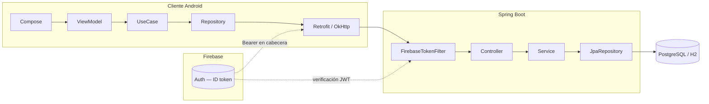

---

## 2. Primeras pantallas o interfaz inicial.
  - Pantalla iniciar sesión:
  
  - Pantalla home de paciente:

  - Pantalla elegir el rol: 

  - Pantalla agendar una cita: 

  - Pantalla cita agendada: 


## 3. Conexión con la base de datos

El backend persiste el dominio principal en una base **relacional** (PostgreSQL en despliegue en Render, H2 en desarrollo); el cliente Android mantiene una **réplica local** con Room y delega el **chat en tiempo real** a Firebase Realtime Database. Lo que sigue enlaza rutas de configuración reales y el esquema evolutivo: scripts SQL manuales en el servidor y migraciones versionadas en Room.

### 3.1. Sistemas usados

- **PostgreSQL** en producción  (instancia enlazada desde Render).
- **H2 en memoria**, modo compatibilidad PostgreSQL (`MODE=PostgreSQL`), en el perfil `dev` para desarrollo sin Docker ni Postgres local, para realizar pruebas rápidas.
- **Room (SQLite)** como almacén local y caché de datos sincronizables en el cliente Android.
- **Firebase Realtime Database** para mensajería de chat en tiempo real (reglas que acotan lectura y escritura a participantes autenticados).

---

### 3.2. Conexión y propiedades de Spring

[`application.yaml`](bdPsicologiaApp/bdPsicologiaApp/src/main/resources/application.yaml): se excluye la autoconfiguración de BD embebida y de la consola H2 (sólo Postgres en despliegue), Hibernate usa `ddl-auto: validate` y el bloque `server` prepara la escucha detrás de proxy (Render, Docker).

Datasource, JPA y servidor:

```5:36:c:\Users\jesus\Documents\DAM2\TFG\bdPsicologiaApp\bdPsicologiaApp\src\main\resources\application.yaml
spring:
  application:
    name: bdPsicologiaApp

  autoconfigure:
    exclude:
      - org.springframework.boot.autoconfigure.jdbc.EmbeddedDatabaseAutoConfiguration
      - org.springframework.boot.autoconfigure.h2.H2ConsoleAutoConfiguration

  servlet:
    multipart:
      max-file-size: 5MB
      max-request-size: 6MB

  datasource:
    url: ${SPRING_DATASOURCE_URL}
    username: ${SPRING_DATASOURCE_USERNAME}
    password: ${SPRING_DATASOURCE_PASSWORD}
    driver-class-name: org.postgresql.Driver

  jpa:
    hibernate:
      ddl-auto: validate
    show-sql: false
    database-platform: org.hibernate.dialect.PostgreSQLDialect

# Render/Docker: hay que escuchar en todas las interfaces; si no, el health check no ve el puerto.
server:
  port: ${PORT:8080}
  address: 0.0.0.0
  # Tras proxy (Render, etc.): scheme/host/puerto públicos en HttpServletRequest
  forward-headers-strategy: framework
```

OpenAPI y Swagger UI desactivados en el perfil por defecto (sólo activos con `dev`):

```38:43:c:\Users\jesus\Documents\DAM2\TFG\bdPsicologiaApp\bdPsicologiaApp\src\main\resources\application.yaml
# Swagger/OpenAPI solo en perfil "dev" (ver application-dev.yaml)
springdoc:
  api-docs:
    enabled: false
  swagger-ui:
    enabled: false
```

[`application-dev.yaml`](bdPsicologiaApp/bdPsicologiaApp/src/main/resources/application-dev.yaml): H2 en memoria con `MODE=PostgreSQL`, `ddl-auto: update`, trazas SQL y **springdoc** habilitado; `spring.sql.init.mode: never` evita ejecutar `data.sql` u otros scripts SQL de arranque en este perfil.

```1:26:c:\Users\jesus\Documents\DAM2\TFG\bdPsicologiaApp\bdPsicologiaApp\src\main\resources\application-dev.yaml
spring:
  config:
    activate:
      on-profile: dev

  datasource:
    url: jdbc:h2:mem:bdpsicologia;MODE=PostgreSQL;DB_CLOSE_DELAY=-1;DB_CLOSE_ON_EXIT=FALSE
    driver-class-name: org.h2.Driver
    username: sa
    password:

  jpa:
    hibernate:
      ddl-auto: update
    show-sql: true
    database-platform: org.hibernate.dialect.H2Dialect

  sql:
    init:
      mode: never

springdoc:
  api-docs:
    enabled: true
  swagger-ui:
    enabled: true
```

### 3.3. Migraciones Room en cliente

La base Room se construye en [`BaseDeDatosModulo.kt`](app/src/main/java/dam2/tfg/psicologiaapp/di/BaseDeDatosModulo.kt): el `databaseBuilder` enlaza las migraciones `1→2`, `2→3` y `3→4` antes de `build()`.

```91:102:c:\Users\jesus\Documents\DAM2\TFG\psicologiaapp\app\src\main\java\dam2\tfg\psicologiaapp\di\BaseDeDatosModulo.kt
    @Provides
    @Singleton
    fun proporcionarBaseDeDatos(
        @ApplicationContext contextoAplicacion: Context
    ): PsicologiaAppDatabase =
        Room.databaseBuilder(
            contextoAplicacion,
            PsicologiaAppDatabase::class.java,
            "psicologia_app.db"
        )
            .addMigrations(migracion_1_2, migracion_2_3, migracion_3_4)
            .build()
```

[`PsicologiaAppDatabase.kt`](app/src/main/java/dam2/tfg/psicologiaapp/data/local/PsicologiaAppDatabase.kt) declara **versión 4** y las entidades `UsuarioEntity`, `PacienteEntity`, `PsicologoEntity`, `NotaEntity`, `TareaEntity`:

```19:28:c:\Users\jesus\Documents\DAM2\TFG\psicologiaapp\app\src\main\java\dam2\tfg\psicologiaapp\data\local\PsicologiaAppDatabase.kt
@Database(
    entities = [
        UsuarioEntity::class,
        PacienteEntity::class,
        PsicologoEntity::class,
        NotaEntity::class,
        TareaEntity::class,
    ],
    version = 4,
    exportSchema = false
)
```

Resumen funcional en el mismo módulo: **1→2** crea las tablas `notas` y `tareas`; **2→3** reconstruye `usuarios` (tabla nueva, copia desde columnas previas con `nombreUsuario` → `nombre`/`apellidos`); **3→4** añade en `notas` la columna `ultimaModificacion` (TEXT con valor por defecto vacío para filas ya existentes).

---

### 3.4. Datos iniciales

[`data.sql`](bdPsicologiaApp/bdPsicologiaApp/src/main/resources/data.sql) puede vaciar datos previos (`DELETE`) y después inserta un PACIENTE, un PSICOLOGO y su fila en `psicologo`, con **`ON CONFLICT DO NOTHING`** y reinicio de secuencias en PostgreSQL con `setval`:

```1:23:c:\Users\jesus\Documents\DAM2\TFG\bdPsicologiaApp\bdPsicologiaApp\src\main\resources\data.sql
-- Borra los datos existentes para empezar de cero en cada reinicio (opcional pero recomendado para pruebas)
DELETE
FROM psicologo;
DELETE
FROM usuario;

-- Inserta un usuario que será solo un paciente
INSERT INTO usuario (id, fire_base_uid, email, nombre_usuario, rol)
VALUES (1, 'uid_paciente_prueba_123', 'paciente@test.com', 'paciente_test', 'PACIENTE') ON CONFLICT (id) DO NOTHING;
-- Evita errores si el ID ya existe

-- Inserta otro usuario que será un psicólogo
INSERT INTO usuario (id, fire_base_uid, email, nombre_usuario, rol)
VALUES (2, 'uid_psicologo_prueba_456', 'psicologo@test.com', 'psicologo_test', 'PSICOLOGO') ON CONFLICT (id) DO NOTHING;

-- Inserta el perfil del psicólogo, asociándolo al usuario con id=2
INSERT INTO psicologo (id, numero_colegiado, especialidad, usuario_id)
VALUES (1, 'COL-98765', 'Terapia de Pareja', 2) ON CONFLICT (id) DO NOTHING;

-- Es buena práctica reiniciar las secuencias para que los nuevos IDs no choquen
-- La sintaxis puede variar un poco entre bases de datos, para PostgreSQL es así:
SELECT setval('usuario_id_seq', (SELECT MAX(id) FROM usuario));
SELECT setval('psicologo_id_seq', (SELECT MAX(id) FROM psicologo));
```

Con el perfil `dev`, `spring.sql.init.mode: never` evita que Spring Boot ejecute este script al arrancar; debe aplicarse explícitamente donde interese sembrar Postgres (por ejemplo con `psql` o herramienta equivalente).

---

### 3.5. Reglas de Firebase Realtime Database (chats)

[`firebase.json`](firebase.json) enlaza las reglas del Realtime Database al fichero `database.rules.json`:

```1:6:c:\Users\jesus\Documents\DAM2\TFG\psicologiaapp\firebase.json
{
  "database": {
    "rules": "database.rules.json"
  }
}
```

En [`database.rules.json`](database.rules.json), bajo `chats/$chatId/mensajes`:

- **Lectura** de la lista de mensajes: solo si hay `auth` y el UID está en `participantes` del chat.
- **Escritura** por mensaje: mismo requisito de participación; la regla `validate` exige hijos `texto`, `remitenteUid` y `enviadoEn`, fuerza que `remitenteUid` coincida con `auth.uid`, que `texto` sea cadena y `enviadoEn` sea numérico.

```1:15:c:\Users\jesus\Documents\DAM2\TFG\psicologiaapp\database.rules.json
{
  "rules": {
    "chats": {
      "$chatId": {
        "mensajes": {
          ".read": "auth != null && root.child('chats/' + $chatId + '/participantes').child(auth.uid).val() == true",
          "$mensajeId": {
            ".write": "auth != null && root.child('chats/' + $chatId + '/participantes').child(auth.uid).val() == true",
            ".validate": "newData.hasChildren(['texto', 'remitenteUid', 'enviadoEn']) && newData.child('remitenteUid').val() == auth.uid && newData.child('texto').isString() && newData.child('enviadoEn').isNumber()"
          }
        }
      }
    }
  }
}
```

### 3.6. Prueba básica de lectura o escritura (por ejemplo: insertar y mostrar datos)

  - Crear nueva nota:

  - Ver mis notas: 

---

## 4. Capturas de pantalla

### 4.1. Pantalla de inicio de sesión

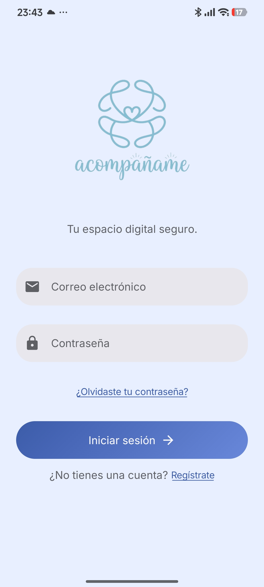

En esta pantalla pide los datos de inicio de sesión al usuario; si no tiene una cuenta, puede registrarse.

### 4.2. Pantalla de registro (elección de rol)

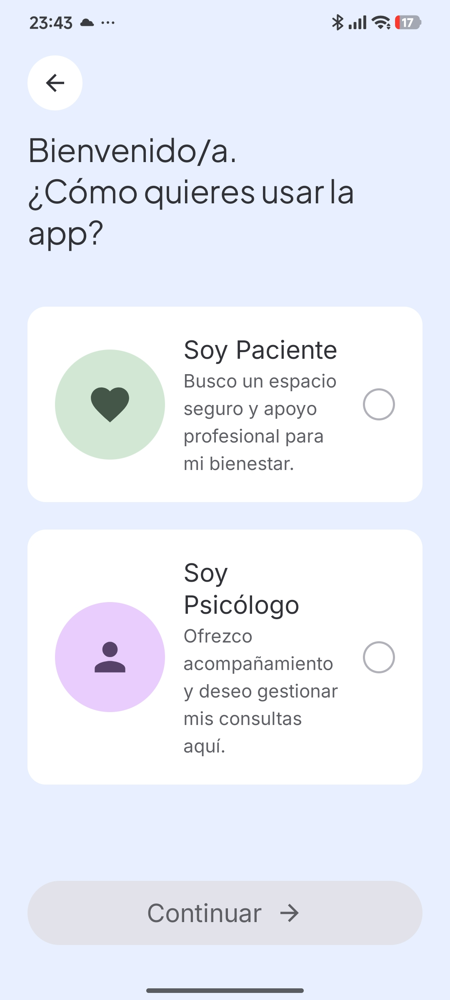

Se da a elegir al usuario qué rol escogerá para usar la app.

### 4.3. Pantalla de registro de paciente/psicólogo

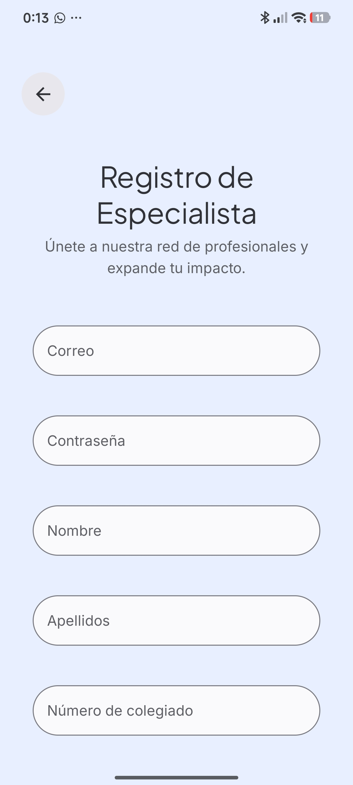

Pide los datos necesarios para registrar un paciente o psicólogo.

### 4.4. Home de paciente sin terapeuta asignado

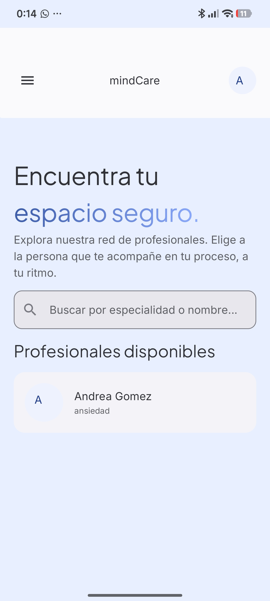

Muestra una lista de usuarios con el rol psicólogo que estén registrados en la app.

### 4.5. Perfil de psicólogo

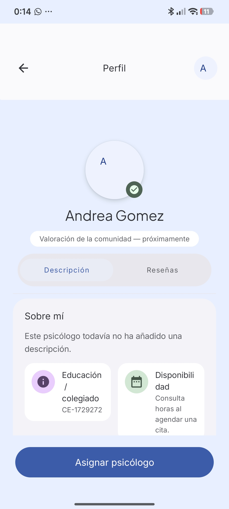

Muestra el perfil del psicólogo.

### 4.6. Home de paciente con psicólogo asignado

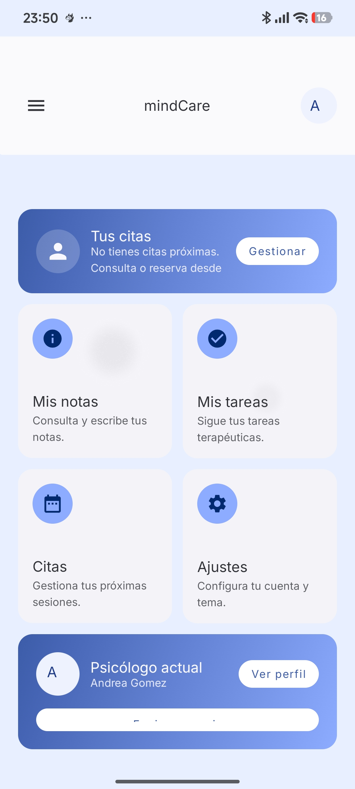

Muestra un panel para elegir diferentes pantallas: nombre del psicólogo asignado, gestionar citas, próxima cita, ajustes y un chat para hablar con el psicólogo.

### 4.7. Crear nota

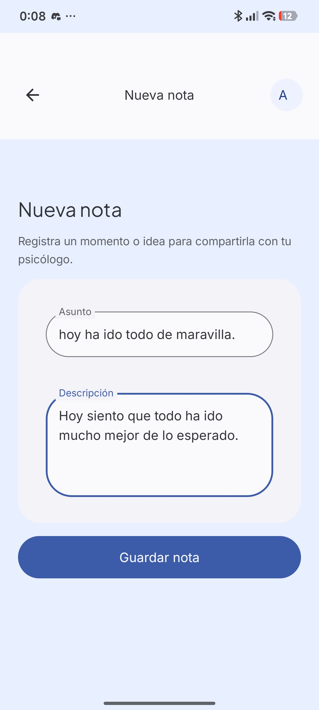

Pantalla que pide un título y un contenido; la nota puede publicarse para que sea visible para el psicólogo.

### 4.8. Notas del paciente

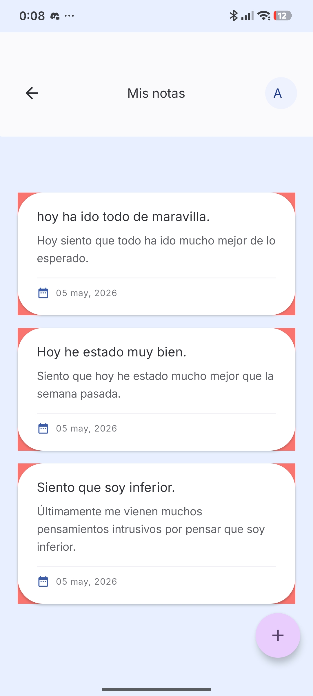

Pantalla que muestra las notas del paciente autenticado.

### 4.9. Agendar cita

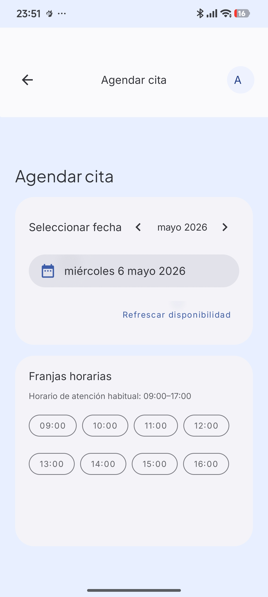

Permite agendar una cita nueva eligiendo el día y la hora disponible. Si la hora ya está asignada por otro usuario, no estará disponible. También es posible usar un calendario para mayor comodidad.

### 4.10. Cita agendada

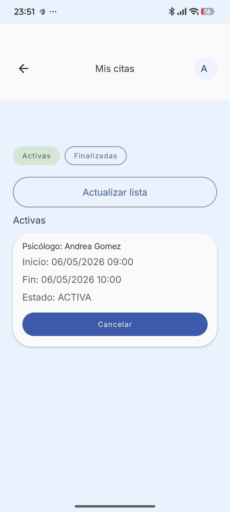

Permite ver las citas que están agendadas y las que ya han pasado para llevar un registro completo de cada sesión terapéutica.

### 4.11. Home de psicólogo

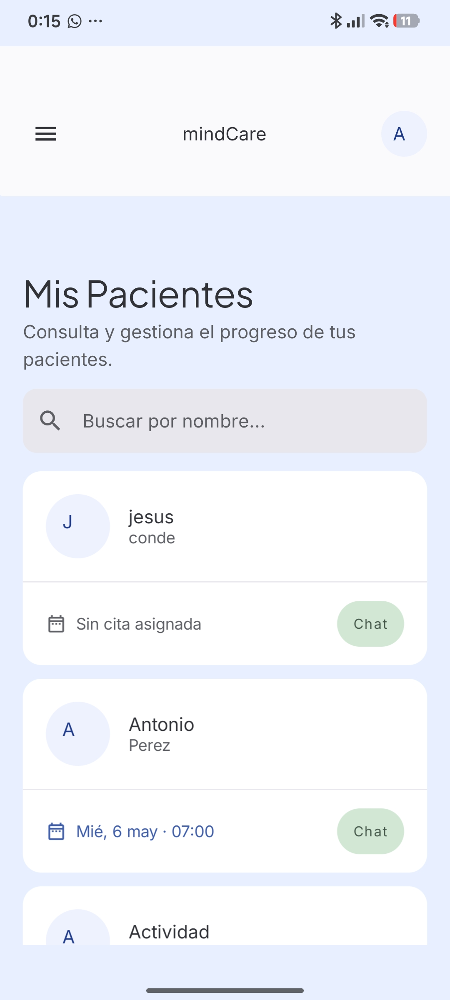

Muestra cada paciente asignado, si tienen citas asignadas y un botón de chat para conversar con ellos.


## 5. Conclusión

### 5.1. Conseguido hasta ahora.

He conseguido tener una app que gestiona y acompaña a los pacientes en su trayectoría terapéutica. La app contiene una base de datos desplegada en render, esto permite desplegar una web y funcionaria bien ya que el backend está desacoplado del frontend. La app es completamente funcional, falta pulir detalles en el frontend para ver correctamente, algunos bugs menores.

### 5.2. Que queda pendiente todavía.

Falta testear que la app sea lo más segura posible, añadir más seguridad si hace falta.

### 5.3. Confirmar la viabilidad del proyecto.

La app es completamente viable, funciona a la perfección.


