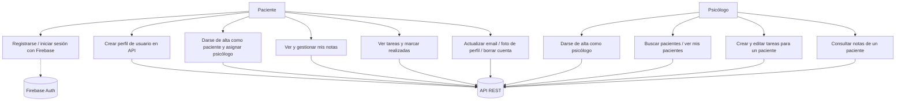
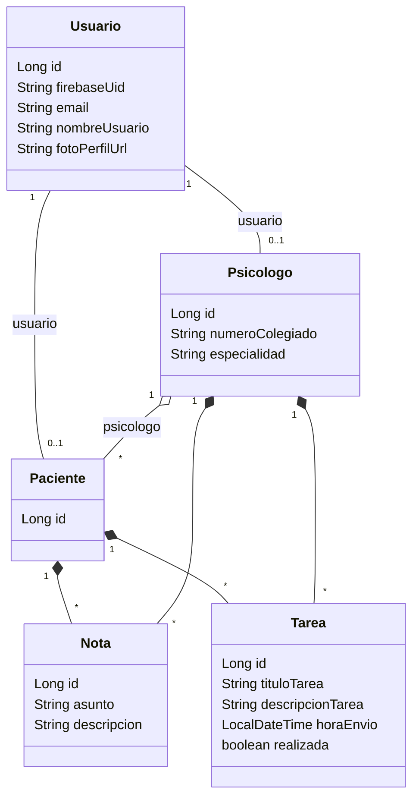
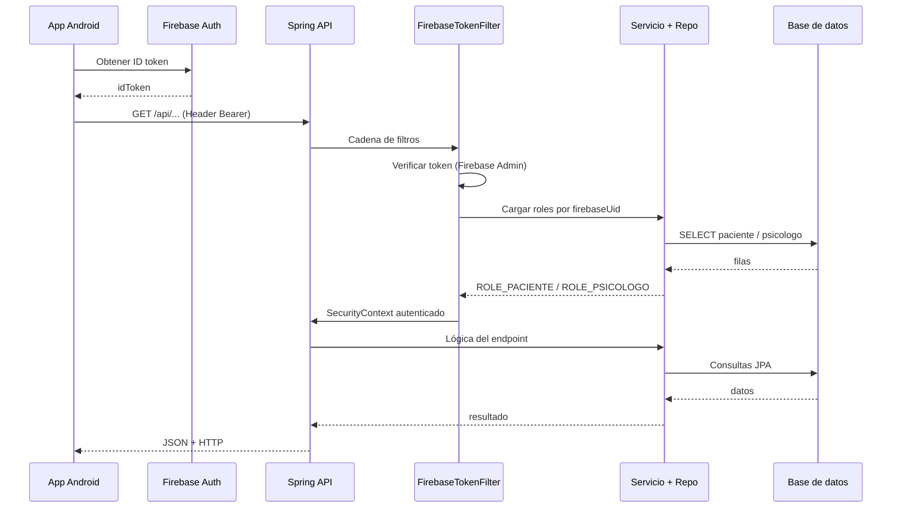
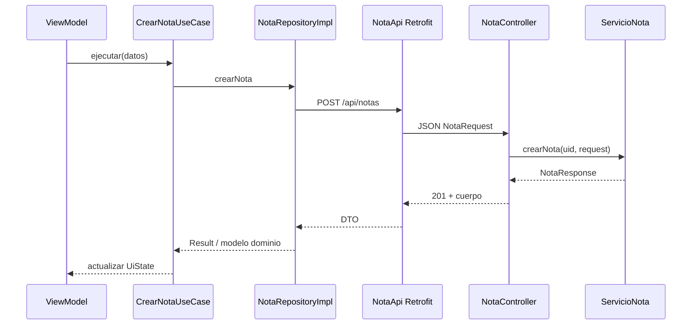
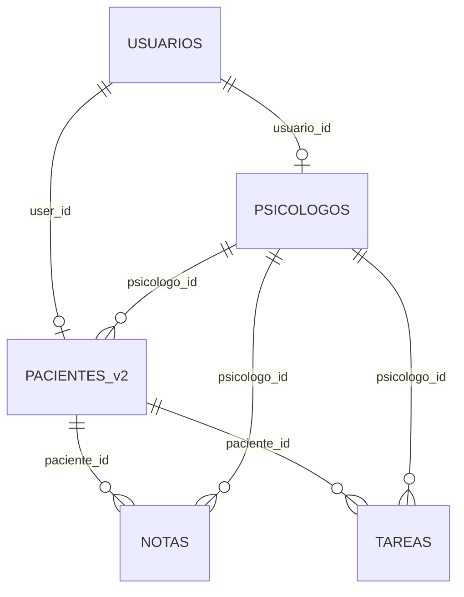

# Diseño del sistema — PsicologíaApp

Documento de diseño del **ecosistema TFG**: aplicación Android **PsicologíaApp** (cliente) y API REST **bdPsicologiaApp** (backend Spring Boot). Ambos repositorios comparten dominio de negocio (usuarios, psicólogos, pacientes, notas y tareas) y se comunican vía HTTP/JSON con autenticación Firebase.

---

## 1. Arquitectura del sistema

### 1.1. Visión global

El sistema sigue un patrón **cliente–servidor**:

- **Cliente (Android):** Jetpack Compose, arquitectura **MVVM por capas** con inyección **Hilt**. Consume la API REST, autentica al usuario con **Firebase Auth** y adjunta el token en las peticiones.
- **Servidor (Spring Boot 3):** API REST bajo el prefijo `/api`, persistencia **JPA/Hibernate** sobre **PostgreSQL** (producción) o **H2** (perfil `dev`), seguridad **Spring Security** con filtro que valida tokens **Firebase** y asigna roles según registros en BD.
- **Servicios externos:** **Firebase** (identidad y verificación de ID token en backend; SDK en cliente). Opcionalmente **Firebase App Check** en el cliente.

### 1.2. Arquitectura por capas — aplicación Android (`psicologiaapp`)

| Capa             | Responsabilidad                                                                                           | Tecnologías                                                      |
| ---------------- | --------------------------------------------------------------------------------------------------------- | ---------------------------------------------------------------- |
| **presentation** | Pantallas Compose, estado de UI (`UiState`), ViewModels, navegación                                       | Jetpack Compose, Navigation Compose, Hilt ViewModel, `StateFlow` |
| **domain**       | Modelos de negocio, contratos de repositorio, casos de uso                                                | Kotlin puro (sin dependencias de Android/data)                   |
| **data**         | Fuentes remotas (Retrofit), locales (Room), mappers DTO/Entity ↔ dominio, implementaciones de repositorio | Retrofit, OkHttp, Gson, Room, módulos Dagger/Hilt                |

**Dependencias entre capas:** `presentation` → `domain` ← `data` (el dominio no conoce la UI ni el detalle de Retrofit/Room).

Estructura típica por feature (`usuario`, `paciente`, `psicologo`, `nota`, `tarea`, `auth`, `preferencias`):

- `data/remote` — interfaces `*Api` y DTOs alineados con el backend.
- `data/local` — entidades Room y DAOs (donde aplica).
- `data/mappers` — extensiones `toDomain()`, `toEntity()`, etc.
- `data/repository` — orquestación local/remoto.
- `domain/usecase`, `domain/repository`, `domain/model`.
- `presentation/ui/...` — pantallas, ViewModel, `UiState`.

Persistencia local: **Room** (`PsicologiaAppDatabase`) con entidades `UsuarioEntity`, `PacienteEntity`, `PsicologoEntity` para caché/offline parcial según el uso en repositorios. **DataStore** para preferencias (por ejemplo tema).

Red: **Retrofit** con `BuildConfig.BASE_URL` (flavor `local`: emulador hacia `10.0.2.2:8080`; `prod`: despliegue público). Interceptor y authenticator para **Bearer token** Firebase y refresco.

### 1.3. Arquitectura por capas — backend (`bdPsicologiaApp`)

| Capa           | Responsabilidad                                          | Tecnologías                                                                       |
| -------------- | -------------------------------------------------------- | --------------------------------------------------------------------------------- |
| **web**        | Controladores REST, DTOs de entrada/salida, mappers HTTP | Spring Web, `spring-boot-starter-validation`, SpringDoc (OpenAPI en perfil `dev`) |
| **service**    | Reglas de negocio, orquestación, interfaces `IServicio`* | Spring `@Service`, transacciones                                                  |
| **repository** | Acceso a datos                                           | Spring Data JPA                                                                   |
| **domain**     | Entidades JPA (`@Entity`)                                | Jakarta Persistence (Hibernate)                                                   |
| **security**   | Cadena de filtros, roles, integración Firebase           | Spring Security, `firebase-admin`                                                 |
| **config**     | Firebase, OpenAPI, etc.                                  | Spring `@Configuration`                                                           |

Los controladores delegan en servicios; los servicios usan repositorios y entidades. Los roles `ROLE_PACIENTE` y `ROLE_PSICOLOGO` se resuelven en `ServicioRoles` consultando si existe fila en `Paciente` / `Psicologo` vinculada al `firebase_uid` del usuario.

---

## 2. Diagramas UML

Los diagramas siguientes usan **Mermaid** (compatible con GitHub, muchos visores Markdown y herramientas online).

### 2.1. Diagrama de casos de uso (resumen)

Actores: **Paciente**, **Psicólogo**, **Sistema (Firebase + API)**.

### 2.2. Diagrama de clases (modelo de dominio del servidor — simplificado)

Refleja las entidades JPA y asociaciones principales.

### 2.3. Diagrama de secuencia — petición autenticada (ejemplo)

Flujo típico: el cliente envía `Authorization: Bearer <idToken>`; el servidor valida y autoriza.

### 2.4. Diagrama de secuencia — paciente crea una nota

---

## 3. Diseño de la base de datos

### 3.1. Modelo lógico relacional (servidor)

Motor principal: **PostgreSQL** (variables `SPRING_DATASOURCE_`*). En desarrollo, perfil `**dev`**: **H2 en memoria** con modo compatible PostgreSQL.

Hibernate `ddl-auto: update` genera/ajusta el esquema a partir de las entidades.

**Tablas (entidades JPA):**

| Tabla (nombre físico) | Descripción                                                                                                                           |
| --------------------- | ------------------------------------------------------------------------------------------------------------------------------------- |
| `USUARIOS`            | Usuario base: `firebase_uid` único, email, `nombreUsuario`, `foto_perfil` (URL o referencia servida por `/api/archivos/perfiles/...`) |
| `PSICOLOGOS`          | 1:1 con usuario (`usuario_id`), `numero_colegiado`, `especialidad`                                                                    |
| `PACIENTES_v2`        | 1:1 con usuario (`user_id`), N:1 opcional con psicólogo (`psicologo_id`)                                                              |
| `NOTAS`               | N:1 `paciente_id`, N:1 `psicologo_id`; `asunto`, `descripcion`                                                                        |
| `TAREAS`              | N:1 `paciente_id`, N:1 `psicologo_id`; título, descripción, `hora_envio`, `realizada`                                                 |

**Cardinalidades clave:**

- Un **Usuario** puede tener a lo sumo un **Psicologo** y/o un **Paciente** (perfiles distintos en la práctica de negocio).
- **Nota** y **Tarea** vinculan siempre a un paciente y a un psicólogo (autor/asignador).

### 3.2. Base de datos local en el cliente (Room)

SQLite vía **Room**, esquema **independiente** del servidor pero alineado conceptualmente:

- `usuarios` (`usuarioId`, `firebaseUid`, `nombreUsuario`, `fotoPerfilUrl`, `rol`)
- `pacientes` (`idPaciente`, `usuarioId`, `psicologoId`)
- `psicologos` (`usuarioId`, `numeroColegiado`, `especialidad`)

Sirve para **persistencia en dispositivo** (caché, offline limitado) según la lógica de cada repositorio. **Notas y tareas** en el cliente se consumen principalmente vía API (DTOs); no están en el `Database` actual como entidades Room.

### 3.3. Otras formas de almacenamiento

- **Ficheros de foto de perfil** en disco del servidor (`app.fotos-perfil.directorio`), expuestos en lectura pública por `GET /api/archivos/perfiles/{nombreFichero}`.
- **DataStore** en Android para preferencias de aplicación (por ejemplo modo de tema).

---

## 4. Diseño de la interfaz de usuario

Capturas de la aplicación Android (Jetpack Compose). Las imágenes están en la carpeta `doc/diseño-interfaz-app/`. Se muestran con ancho fijo (~480px) para una lectura cómoda en PDF y visores Markdown; si la vista es estrecha, el visor puede escalarlas.

### 4.1. Inicio de sesión

### 4.2. Registro

### 4.3. Inicio del paciente

### 4.4. Tareas asignadas

### 4.5. Perfil de usuario

---

## 5. Diseño de la API y servicios externos

### 5.1. Autenticación y autorización

- El cliente obtiene un **ID token** de Firebase y lo envía como **Bearer**.
- `FirebaseTokenFilter` valida el token con **Firebase Admin SDK** y rellena el `SecurityContext` con `FirebaseUserData`.
- `ServicioRoles` asigna `ROLE_PACIENTE` y/o `ROLE_PSICOLOGO` según existencia en BD.
- Endpoints sensibles usan `@PreAuthorize("hasRole('PACIENTE')")` o `hasRole('PSICOLOGO')`.
- Rutas públicas: documentación OpenAPI (en `dev`), y `GET /api/archivos/perfiles/`** para servir imágenes.

### 5.2. Resumen de recursos REST

Prefijos indicados respecto a la raíz del servidor (p. ej. `https://host/`).

**Usuarios — `/api/usuarios`**

| Método | Ruta                          | Descripción (resumida)                       |
| ------ | ----------------------------- | -------------------------------------------- |
| GET    | `/api/usuarios`               | Listar usuarios                              |
| GET    | `/api/usuarios/me`            | Perfil del usuario autenticado               |
| PATCH  | `/api/usuarios/me/email`      | Actualizar email                             |
| POST   | `/api/usuarios/me/foto`       | Subir foto (multipart `archivo`)             |
| DELETE | `/api/usuarios/me`            | Eliminar mi usuario                          |
| GET    | `/api/usuarios/{fireBaseUid}` | Usuario por UID Firebase                     |
| POST   | `/api/usuarios`               | Crear usuario (token debe coincidir con UID) |

**Psicólogos — `/api/psicologos`**

| Método | Ruta                                      | Notas                                   |
| ------ | ----------------------------------------- | --------------------------------------- |
| GET    | `/api/psicologos`                         | Listado                                 |
| POST   | `/api/psicologos/me`                      | Alta psicólogo ligado al usuario        |
| GET    | `/api/psicologos/me`                      | **Rol PSICOLOGO**                       |
| GET    | `/api/psicologos/buscar?nombreUsuario=`   | **Rol PACIENTE**                        |
| GET    | `/api/psicologos/firebaseId/{firebaseId}` | Por Firebase                            |
| GET    | `/api/psicologos/id/{id}`                 | Por id numérico                         |
| GET    | `/api/psicologos/me/pacientes`            | **Rol PSICOLOGO** — pacientes asociados |

**Pacientes — `/api/pacientes`**

| Método | Ruta                                     | Notas                                |
| ------ | ---------------------------------------- | ------------------------------------ |
| GET    | `/api/pacientes`                         | Listado                              |
| POST   | `/api/pacientes/me`                      | Alta paciente                        |
| GET    | `/api/pacientes/me`                      | **Rol PACIENTE**                     |
| GET    | `/api/pacientes/buscar?nombreUsuario=`   | **Rol PSICOLOGO**                    |
| GET    | `/api/pacientes/firebaseId/{firebaseId}` | Por Firebase                         |
| GET    | `/api/pacientes/id/{id}`                 | Por id                               |
| PATCH  | `/api/pacientes/me/psicologo`            | **Rol PACIENTE** — asignar psicólogo |

**Notas — `/api/notas`**

| Método | Ruta                                | Notas                         |
| ------ | ----------------------------------- | ----------------------------- |
| GET    | `/api/notas/pacientes/{pacienteId}` | **Rol PSICOLOGO**             |
| GET    | `/api/notas`                        | **Rol PACIENTE** — mis notas  |
| POST   | `/api/notas`                        | **Rol PACIENTE** — crear      |
| PUT    | `/api/notas/{notaId}`               | **Rol PACIENTE** — actualizar |
| DELETE | `/api/notas/{notaId}`               | **Rol PACIENTE** — eliminar   |

**Tareas — `/api/tareas`**

| Método | Ruta                                 | Notas                         |
| ------ | ------------------------------------ | ----------------------------- |
| GET    | `/api/tareas`                        | **Rol PACIENTE** — mis tareas |
| GET    | `/api/tareas/pacientes/{pacienteId}` | **Rol PSICOLOGO**             |
| POST   | `/api/tareas/pacientes/{pacienteId}` | **Rol PSICOLOGO** — crear     |
| PATCH  | `/api/tareas/{tareaId}/realizada`    | **Rol PACIENTE**              |
| PUT    | `/api/tareas/{tareaId}`              | **Rol PSICOLOGO**             |
| DELETE | `/api/tareas/{tareaId}`              | **Rol PSICOLOGO**             |

**Archivos — `/api/archivos/perfiles`**

| Método | Ruta                                     | Notas                                             |
| ------ | ---------------------------------------- | ------------------------------------------------- |
| GET    | `/api/archivos/perfiles/{nombreFichero}` | Público; sirve fichero del directorio configurado |

### 5.3. Servicios externos

- **Firebase Authentication:** registro, inicio de sesión y emisión de ID tokens consumidos por la API.
- **Firebase Admin (backend):** verificación de tokens en cada petición con Bearer.
- **Firebase App Check (cliente):** dependencias presentes en el proyecto Android para endurecer el uso de APIs de Google/Firebase según configuración del desarrollador.

### 5.4. Mapeo cliente Retrofit

Interfaces principales en el módulo `app` (paquetes `*.data.remote`): `UsuarioApi`, `PacienteApi`, `PsicologoApi`, `NotaApi`, `TareaApi`, todas con `baseUrl` + rutas anteriores. Los DTOs viven junto a cada API o en archivos `*Dtos.kt` y se mapean al dominio con funciones en `data/mappers/`.

---

*Jesús Conde Barba - DAM2 - TFG*